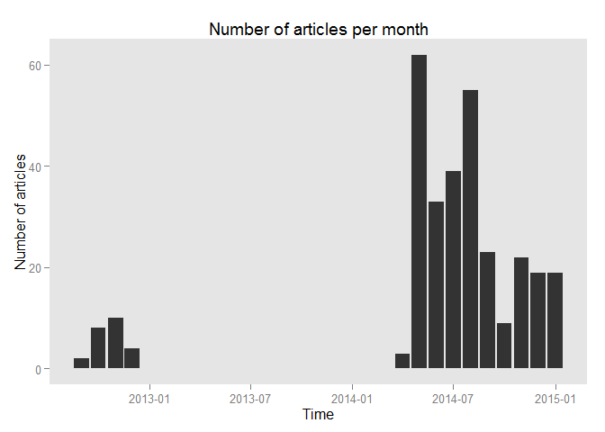
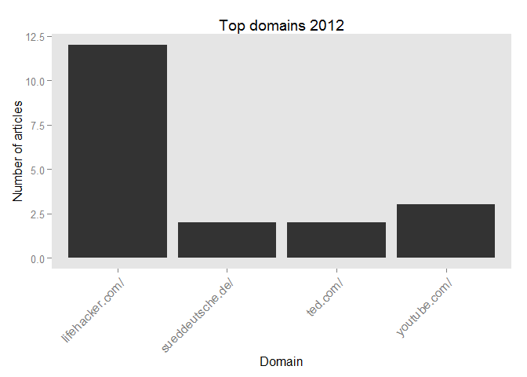
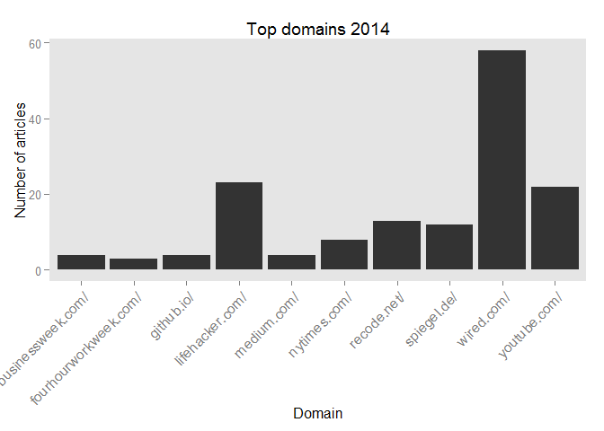
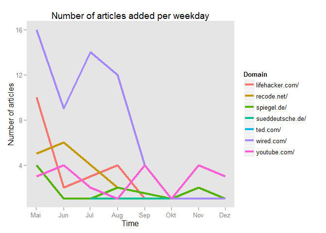
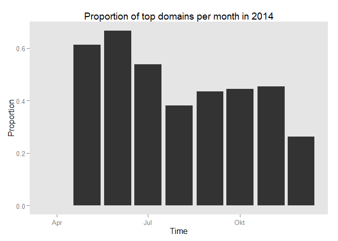
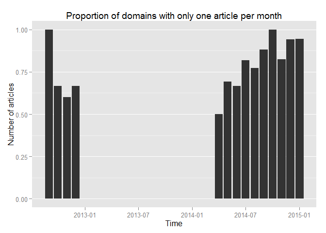
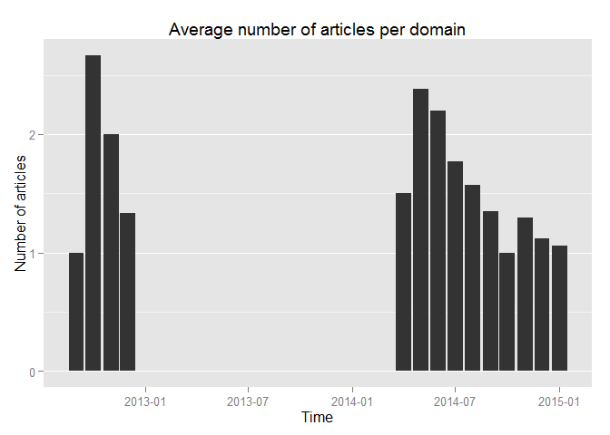
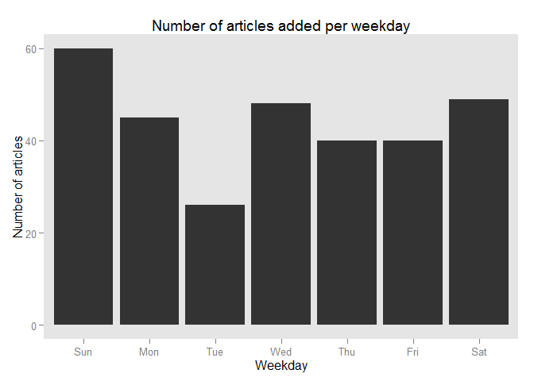
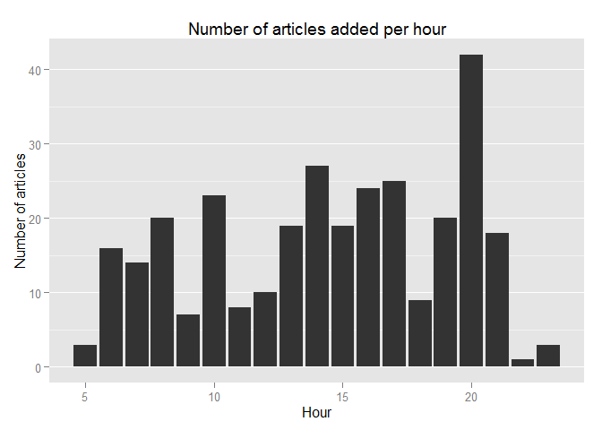

# Exploring my Pocket archive using R
January, 2015  

I am using [Pocket](http://getpocket.com) as my main bookmarking service to store articles I find on the web during the day and want to read later. After I used it constantly for more than half a year, I wanted to evaluate how I actually use Pocket and gain some insights into what kind of articles are of interest to me. For this exploratory analysis I am going to use R. The file pocket_data.rmd in this [Github-Repository](https://github.com/sweb/PocketAnalysis) contains all necessary calls, in case you want to use it as a starting point for your own analysis. Required packages are XML, dplyr, lubridate and ggplot2. The code is clumsy at best, since I am just getting started on doing data analysis using R.

### Retrieving the data

Pocket offers [export functionality](https://getpocket.com/export) as an HTML-file and by using an API. Since I do not want to perform the analysis on a daily basis, a simple manual download seems more appropriate. The resulting file is used as baseline for this analysis.

As a first step, the web links of stored articles are retrieved by searching for \<a\> HTML elements and in particular their attributes:

```r
doc.html = htmlTreeParse(filePath, useInternal = TRUE)
doc.text = xpathApply(doc.html, '//a', xmlAttrs)
names(unlist(doc.text[1]))
```

```
## [1] "href"       "time_added" "tags"
```
We get three attributes:

* href: The link
* time_added: The time stamp, when the link was added to pocket
* tags: Tags assigned to a link

Since I do not use tags, I will concentrate on the first two attributes for the analysis. The provided link offers some potential for direct feature extraction. For example, the base domain is interesting in order to identify common sources for articles from the web.

The base domains can be retrieved by using a Regular Expression on the list of links. First the href-attributes are selected (each third row) and afterwards matched:

```r
doc.flatlist <- unlist(doc.text)
doc.length <- length(doc.flatlist)
doc.rawLinks <- doc.flatlist[seq(1,924,3)]

matches <- regexpr("([^\\.|/]+)\\.([a-z]+)/", doc.rawLinks, perl=TRUE)
doc.domains <- regmatches(doc.rawLinks, matches)
head(doc.domains)
```

```
##                                 href                                 href 
##                 "trivedigaurav.com/"                        "socher.org/" 
##                                 href                                 href 
##                     "princeton.edu/"                   "openculture.com/" 
##                                 href                                 href 
##                         "github.io/" "neuralnetworksanddeeplearning.com/"
```
The time attributes counts seconds, starting from 1970-01-01 and can be transformed into readable dates by using POSIX date formats:

```r
doc.rawTimeAdded <- doc.flatlist[seq(2,924,3)]
doc.parsedTimeAdded <- lapply(lapply(doc.rawTimeAdded, as.integer), 
                              function(x) as.POSIXct(x, origin="1970-01-01",tz = "GMT"))
```
For easier access, several time related features are extracted. All features are then stored in a single data frame:

```r
doc.df <- data.frame(doc.rawLinks,
                     as.integer(doc.rawTimeAdded),
                     doc.domains,
                     sapply(doc.parsedTimeAdded, year), 
                     sapply(doc.parsedTimeAdded, month),
                     sapply(doc.parsedTimeAdded, week),
                     sapply(doc.parsedTimeAdded, day),
                     sapply(doc.parsedTimeAdded, wday),
                     sapply(doc.parsedTimeAdded, hour))

names(doc.df) <- c("Link", "Added.on", "Domain", "Year","Month","Week","Day","Weekday","Hour")
```

### Analysis

First of all, let's see how pocket was used by me. To this end, the number of articles are plotted, based on when they were added:

 

I started using Pocket in 2012 in a rather limited way, stopping at the end of 2012 at 24 stored articles. This stop continued until mid of 2014. At first, just a brief usage is visible. Then, the usage skyrocketed, resulting in a total number of 308 articles. One possible explanation could be that the mode of usage changed significantly comparing to the first usage in 2012, since the number of added articles per month appears to be much larger:

 

After stopping to use Pocket at the end of 2012, I gave it a shot again in April 2014. However, the real start appears to be in May. In fact, after starting to use pocket again, the usage in the second to fifth month (May 2014 to August 2014) is very high, followed by a reduced usage in the next four month (September 2014 to December 2014).

In order to check, if the mode of usage changed, the most visited domains in 2012 and 2014 are compared:

 

There are only four domains in 2012 that contributed more than one article to my Pocket archive. The top domain is [Lifehacker](http://lifehacker.com), which incidentally lead me to use Pocket in the first place. Second place goes to [YouTube](http://youtube.com), followed by [ted.com](http://ted.com) as another video-resource and [Süddeutsche](http://sueddeutsche.de), a German newspaper.

 

In 2014 the variety of domains has changed, allowing a display of top 10 domains with more than one article contribution. The top contributor is now [Wired](wired.com). [Lifehacker](http://lifehacker.com) and [YouTube](http://youtube.com) are still strong, followed by [recode.net](http://recode.net) and [Spiegel Online](http://spiegel.de), a German magazine. In order to discover whether the top domains constantly contribute to the archive or whether there are certain months with a lot of consumption of a particular domain, the number of articles per month are plotted:

 

Most of the wired.com articles were added in May to August, afterwards the number declines. Lifehacker articles are strong in May but decline afterwards rather quickly. YouTube appears to be somehow constant, since it does not display a decline but more of an on/off pattern. Let's see how much the identified top domains contribute to the total number of articles per month:

 

After July, a notable decline in share can be noted, even though the share recovers in the following months until December, where the lowest share so far is achieved. This may indicate a shift in interests or a greater variety of sources. Thus, the proportion of unique domains with only one article contributing to a month is checked as a next step.

 

It appears as if the proportion of single-article domains is rising, indicating a larger variety of sources. This observation is also backed by the following query, checking the number of articles per domain per month. Starting in July 2014, the number average number of articles per domain decreases, getting quite close to one article per domain in December 2014.

 

After an extensive look into domains, some other starting points for further analysis are explored. The following plot displays the number of articles that were added on which weekday.

 

Sunday is the weekday with the most while Tuesday is the weekday with the least articles added. Both differ a lot from the other days. The next plot displays the number of articles added during which hour of the day.

 

The time slot from 8 p.m. to 9 p.m. has by far the most added articles. Between midnight and 5 a.m. no articles are added.

### Conclusion
This is just a first glimpse into the available data provided by the archive export of Pocket. I was able to identify some points to follow up on:

* The number of articles added per month spikes in May and July. Another observation shows that wired.com articles were extensively added in these month. As a next step one could check, whether the number of articles per month is more constant if wired.com articles are removed from counts.
* The analysis of articles per weekdays indicates that articles are added more often on Sundays than on other weekdays. This could be caused by a single incident in which I went on some kind of bookmarking spree - looking at the observation above, probably on wired.com.
* The insights into the content of articles are extremely limited. In the analysis, only the domain may indicate what kind of content was bookmarked. Possible starting points for further analysis could be the displayed name of the link, which was not retrieved for this analysis and the contents of linked articles.

Besides continuing the analysis, it should be easy enough to create a simple dashboard, e.g. to get a monthly update of my current usage. However, additional information like the time an article was marked as read would help to get an angle on the consumption of bookmarked articles, not just the bookmarking behavior.
